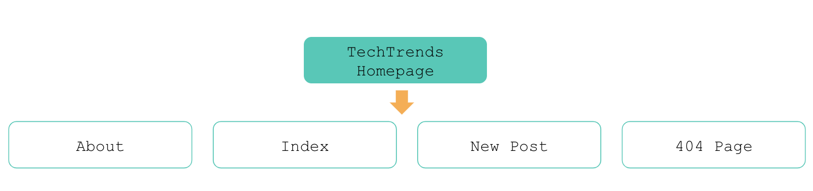
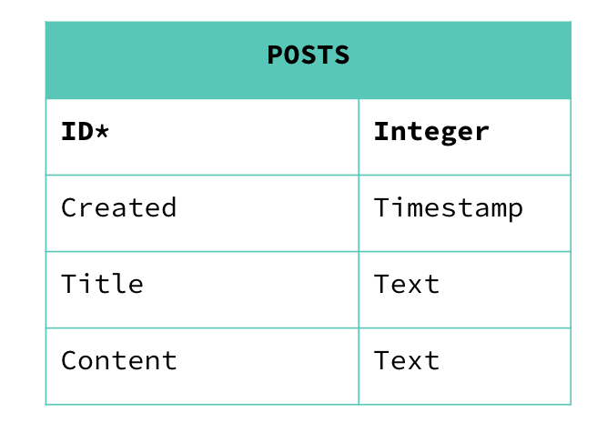

# blog-web-docker-githubaction-helm-k8s-argocd

Apply the best development practices and develop the status and health check endpoints for the TechTrends application.
Package the TechTrends application by creating a Dockerfile and Docker image.
Implement the Continuous Integration practices, by using GitHub Actions to automate the build and push of the Docker image to DockerHub.
Construct the Kubernetes declarative manifests to deploy TechTrends to a sandbox namespace within a Kubernetes cluster. The cluster should be provisioned using k3s in a vagrant box.
Template the Kubernetes manifests using a Helm chart and provide the input configuration files for staging and production environments.
Implement the Continuous Delivery practices, by deploying the TechTrends application to staging and production environments using ArgoCD and the Helm chart.

</img>

</img>

</img>

## Best Practices For Application Deployment

Healthcheck endpoint
Build the /healthz endpoint for the TechTrends application. The endpoint should return the following response:

An HTTP 200 status code
A JSON response containing the result: OK - healthy message
Metrics endpoint
Build a /metrics endpoint that would return the following:

An HTTP 200 status code
A JSON response with the following metrics:
Total amount of posts in the database
Total amount of connections to the database. For example, accessing an article will query the database, hence will count as a connection.
Example output: {"db_connection_count": 1, "post_count": 7}

Tips: The /metrics endpoint response should NOT be hardcoded.

Logs
Extend the TechTrends application to log the following events:

An existing article is retrieved. The title of the article should be recorded in the log line.
A non-existing article is accessed and a 404 page is returned.
The "About Us" page is retrieved.
A new article is created. The title of the new article should be recorded in the logline.
Every log line should include the timestamp and be outputted to the STDOUT. Also, capture any Python logs at the DEBUG level.

Example output of loglines:
```bash
INFO:werkzeug:127.0.0.1 - - [08/Jan/2021 22:40:06] "GET /metrics HTTP/1.1" 200 -
INFO:werkzeug:127.0.0.1 - - [08/Jan/2021 22:40:09] "GET / HTTP/1.1" 200 -
INFO:app:01/08/2021, 22:40:10, Article "2020 CNCF Annual Report" retrieved!
```